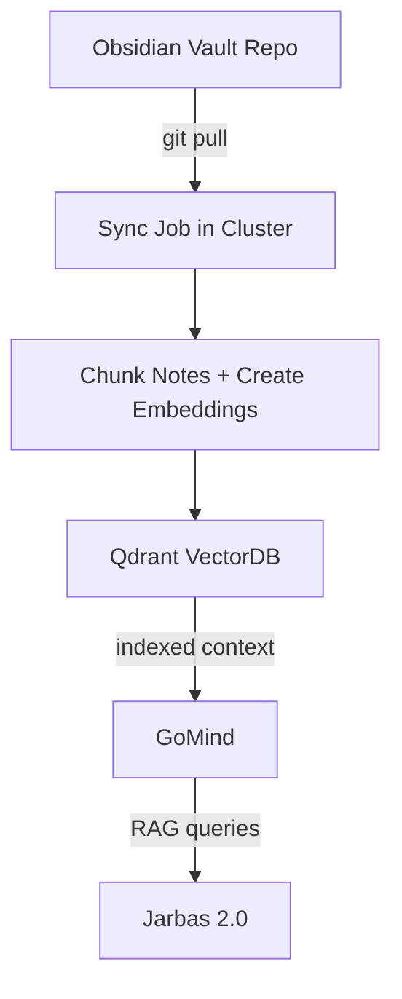
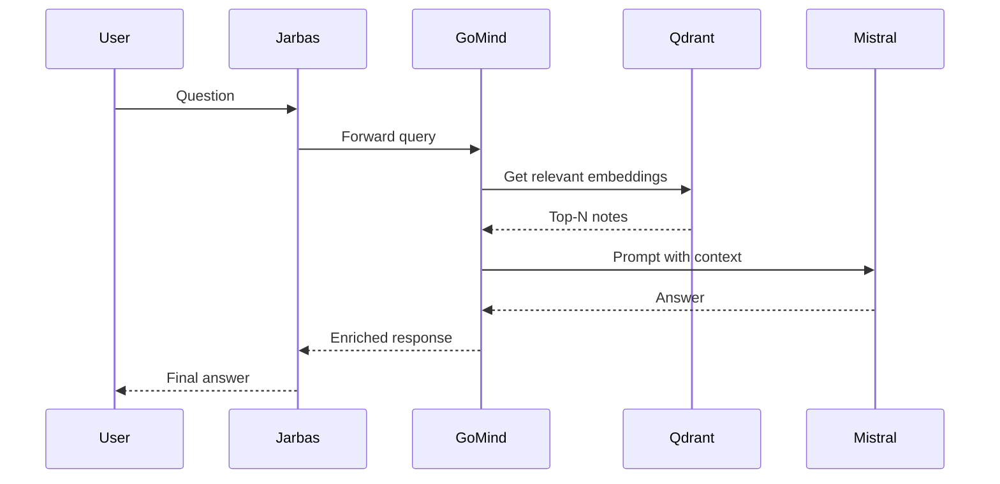

# Jarbas 2.0 + GoMind + RAG Roadmap

This document describes the ordered set of tasks to evolve **Jarbas 2.0** into a full Pentest Copilot using **GoMind**, **Qdrant** as vector database, and a **private container registry** for image management inside the cluster.  

---

## 1. Private Image Registry (base infra)

- [ ] Deploy a **Docker Registry** inside the cluster (namespace `infra`).  
- [ ] Configure access via intranet (`registry.local:5000`).  
- [ ] Adjust GoMind and other services to pull images from this registry.  
- [ ] Automate local build & push:  

```sh
docker build -t registry.local/gomind:tag .
docker push registry.local/gomind:tag
```

*(Optional: later migrate to Harbor if you want UI + security scanning).*  

---

## 2. VectorDB (Jarbas 2.0 memory)

- [ ] Deploy **Qdrant** inside the cluster (namespace `gomind`).  
- [ ] Create initial collection (`notes`).  
- [ ] Test manual insertion/query via Qdrant API.  

---

## 3. Notes → Qdrant Sync Pipeline

- [ ] Create a **Kubernetes CronJob** (namespace `gomind`) that:  
  - Performs `git pull` from the Obsidian vault repository.  
  - Runs a Go script (part of GoMind) that:  
    - Reads `.md` files and splits them into chunks.  
    - Generates embeddings (Ollama `nomic-embed-text`).  
    - Inserts/updates into Qdrant.  
- [ ] Implement deduplication (hash or last-modified).  
- [ ] Test with a new note and verify it appears in Qdrant.  



---

## 4. GoMind ↔ Qdrant Integration

- [ ] Add module in GoMind to:  
  - Receive query (via MCP/Jarbas).  
  - Generate embedding for the query.  
  - Fetch top-N results from Qdrant.  
  - Build a prompt with context for Mistral.  
- [ ] Expose an action like `searchNotes` inside GoMind.  
- [ ] Test the full flow (Jarbas asks → GoMind answers with RAG context).  



---

## 5. Jarbas 2.0 (Pentest Copilot)

- [ ] Connect Jarbas to GoMind (via MCP).  
- [ ] Jarbas sends user questions → GoMind handles RAG → returns enriched answers.  
- [ ] Expand vault content with:  
  - Playbooks (MITRE ATT&CK, payloads).  
  - Old pentest findings.  
  - Report templates.  

---

## 6. Future Improvements

- [ ] Add sync logging (Jarbas receives notification: *“3 new notes indexed”*).  
- [ ] Automatic classification of findings (using phi3-mini).  
- [ ] Evidence manager (logs, screenshots, nmap, Burp outputs).  
- [ ] CI/CD: GitHub Actions → build & push images automatically to local registry.  
- [ ] If it grows → migrate to **Harbor** for UI + RBAC + vulnerability scanning.  

---

## Summary

**Order of execution:**  
1. Registry  
2. Qdrant  
3. CronJob sync pipeline  
4. GoMind + Qdrant integration  
5. Jarbas 2.0 RAG copilot  
6. Improvements and extras  

